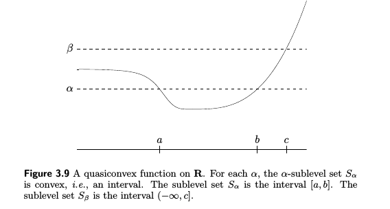

# Before

**convex optimization** is about a class of optimization problem which satisfy the inequality:
$$
f_i(\alpha x+\beta y) \leq \alpha f_i(x)+\beta f_i(y)
$$

$$
for \quad all\quad x,y \in R, all\quad \alpha,\beta \in R \quad with \quad  \alpha+\beta=1, \alpha>0,\beta>0
$$

**convexity** is more general than linearity:

- inequality replaces the more restrictive equality
- inequality must hold only for certain values of alpha and beta

#### *Least-squares and linear programming*

two widely known and used special subclasses of convex optimization.

**Least-squares problems**:
$$
minimize \quad f_0(x)={||Ax-b||}_2^2= \sum_{i=1}^{k}(a_i^Tx-b_i)^2
$$

$$
A \in R^{k \times n} \quad with  \quad k\geq n, vector \quad x \in R^n
$$

have the analytical solution 
$$
x = (A^TA)^{-1}A^Tb
$$
**Statistical interpretations** : least-squares has an **statistical interpretations** as maximum likelihood estimation of a vector *x*, given linear measurements corrupted by Gaussion measurement errors.
$$
y=f(x,\alpha)+\epsilon, \epsilon\sim N(0,\sigma^2)
$$
according to this formula,we could give a the **posterior probability** of a certain y with x and alpha
$$
p(y|x,\alpha,\sigma) = \frac{1}{\sigma\sqrt{2\pi}}e^{-\frac{1}{2\sigma^2}(y-f(x,w))^2}
$$
given a set of y_i,x_i, fit the parameters,using maximum likelihood
$$
L =\prod_{i=1}^k{p(y_i|x_i)}=\frac{1}{\sigma\sqrt{2\pi}}e^{-\frac{1}{2\sigma^2}\sum_{i=1}^k(y_i-f(x_i,w))^2}
$$
maximum this L is equal to the least-squares problems

**Two technique tricks:**

*weighted least-squares*:
$$
\sum_{i=1}^{k}w_i(a_i^Tx-b_i)^2
$$
*regularization*:
$$
\sum_{i=1}^{k}(a_i^Tx-b_i)^2+\rho\sum_{i=1}^n{x_i^2} ,where \quad \rho>0
$$

# Convex Sets

###Affine

***line***: 
$$
x_1,x_2 \in R^n \quad y=\theta x_1+(1-\theta )x_2, \quad \theta \in R, x_1\not= x_2
$$
***affine***: a set *C* satisfy: the line through any two distinct point in *C* lies in *C*, can be generated in k dimensions.

$$
for  \ any  \ x_1,x_2\in C, \theta \in R: \theta x_1+(1-\theta)x_2\in C
$$
***affine hull***: **aff** *C* ,means set of all affine combinations of points in some set C \subseteq R^n is called the affine hull of *C*, and denoted **aff** *C* 
$$
\textbf{aff} \ C=\{\theta_1 x_1+...+\theta_k x_k|x_1,...,x_k \in C, \theta_1+...\theta_k=1\}
$$
***affine dimension***: affine dimension of a set C as the dimension of its affine hall,such as a circle in a 2D space. the affine hall is R^2, so dimension is 2.

***relative interior***: denoted **relint** *C*, if the affine dimension of a set *C* \subseteq R^n is less than n, then the set lies in the affine set **aff** *C*  \not = R^n, we define 
$$
\textbf{relint} \ C = \{x\in C | B(x,r) \cap \textbf{aff}\ C\subseteq C \ for \ some \  r>0\}
$$
***interior of aff C***: **relint** *C* is interior of **aff** *C* .

***relative boundary of set C*** : **cl** *C*  \ **relint** *C*,means the element in closure of  *C*  but not in  **relint** *C* 

###Convex

***convex sets*** : a set *C* is convex if the line segment between any two points in *C* lies in *C*. we can easily find out every affine is convex
$$
for  \ any  \ x_1,x_2\in C, \theta \in [0,1]: \theta x_1+(1-\theta)x_2\in C
$$
***convex hull***: **conv** *C* ,means set of all convex combinations of points in some set C \subseteq R^n is called the convex hull of *C*, and denoted **conv** *C* 
$$
\textbf{conv} \ C=\{\theta_1 x_1+...+\theta_k x_k|x_1,...,x_k \in C, \theta_1+...\theta_k=1\,\ \theta_i  \geq 0 , i=1,...,k \}
$$
it's the smallest convex set that contains *C*. the idea of convex combination can be generalized to include infinite sums,integrals and in the most general form probability distributions. suppose
$$
suppose \quad  p: R^n \to R \quad  satisfies \quad  p(x) \geq 0
$$

$$
for \ all \ x \in C \quad \int_C{p(x)\ dx}=1\quad where \ C \subseteq R^n \ is \ convex \ then
$$

$$
\int_C{p(x)x \ dx \in C}
$$

#### *Cone*

***cone(nonnegative homogeneous)***
$$
for  \ any  \ x_1,x_2\in C, \theta_1>0,\theta_2>0: \theta_1 x_1+\theta_2x_2\in C
$$
***conic hull***: set of all conic combinations of points in *C*, is also the smallest convex cone that contains *C*
$$
\textbf{conic} \ C=\{\theta_1 x_1+...+\theta_k x_k|x_1,...,x_k \in C,\ \theta_i  \geq 0 , i=1,...,k \}
$$

#### *Examples:*

- empty set ,single point whole spaces are affine subset of  R^2
- any line is affine, if pass zero ,it's also convex cone
- halfspaces(sliced by hyperplanes) are convex not affine
- Euclidean balls and ellipsoids are convex
- norm balls are convex

#### *Polyhedra*

A *polyhedra* is defined as the solution set of a finite number of linear equalities and inequalities.
$$
P=\{x|a_j^Tx \leq b_j, j=1,...,m, c_j^Tx=d_j,j=1,...,\}
$$

Intuitively, *polyhedra* is the intersection of a finite number of halfspaces and hyperplanes. easily shown, polyhedra is convex set 

#### *Simplexes(important family of polyhedra)*

Suppose the k+1 points are *affinely independent*, which means any two lines formed by two points are liearly independent.the simmplex determined by them is given by 
$$
C=\textbf {conv}\{v_0,...,v_k\}=\{\theta_0v_0+...+\theta_kv_k| \theta \succcurlyeq0 ,\textbf1^T\theta=1\}
$$
the affine dimension of this simplex is k, so it is sometimes referred to as k-dimensioinal simplex in R^n.

####*Positive semidefinite cone*

we talk about symmetric nxn matrices
$$
\textbf{S}^n=\{X\in R^{n\times n}|X=X^T\}
$$
this is a vector space with dimension n(n+1)/2.the S^n_+ is the set of symmetric positive semidenfinite matices
$$
\textbf{S}^n_+=\{X\in \textbf{S}^n|X\succcurlyeq0\}
$$
and symmetirc postive definite matrices:
$$
\textbf{S}^n_{++}=\{X\in \textbf{S}^n|X\geq0\}
$$
that this symmetric positive definite matrices is a **convex cone**: 
$$
x^T(\theta_1A+\theta_2B)x=\theta_1x^TAx+\theta_2x^TBx\geq0 \quad  if\  A\succcurlyeq0,B\succcurlyeq0, and\  \theta_1,\theta_2\geq0
$$

###Operations that preserve convexity

#### *Intersection*

a example: a polyhedron is the intersection of halfspaces and hyperplanes(which are convex) and therefore is convex. A converse holds: *every* closed convex set S is a(usually infinite) intersection of haslfspaces. **In fact,  a closed convex set *S* is the intersection of all halfspaces that contain it:**
$$
S=\cap\{H|H \  halfspaces, S\subseteq H \}
$$

#### *Affine functions*

we call a function *f* is *affine* if it is sum of a linear function and a constant:
$$
f(x)=Ax+b, \quad where \ A\in R^{m\times n}\ and \ b\in R^m
$$
suppose:
$$
S \subseteq R^n\ S \ is \ convex, f(S) =\{f(x)|x\in S\}\  is \ convex
$$
Example: *scaling, translation, projection, sum of two sets, Cartesian product, Partial Sum*

Example: *Solution set of linear matrix inequality(**LMI**)*
$$
A(x)=x_1A_1+...+x_nA_n\preccurlyeq B\quad where \ B,A_i\in S^m
$$
​		*Indeed, it is the **inverse** image of the positive semidefinite cone under affine function:*
$$
f:R^n \to S^m \ given \ by \ f(x) =B-A(x)
$$

####*Linear-fractional and perspective function*

#####*the perspective function*: 

$$
P:R^{n+1}\to R^n,\ with \ domain \ dom \ P=R^n\times R_{++}
$$

$$
C \subseteq \textbf{dom} \ P \quad  is \ convex,\ then \quad  P(C)={P(x)|x \in C} \quad  is \ convex
$$

the fig pin-hole camera is a perfect example, as we prove the 4 points convex hull *C* project to a line segment image, suppose we have p1 = (x1,y1), p2 = (x2,y2), 
$$
P(\theta p_1+(1-\theta)p_2) =  \frac{\theta x_1+(1-\theta)x_2}{\theta y_1 + (1-\theta )y_2} = \mu P(p_1)+(1-\mu)P(p_2)
$$

$$
\mu = \frac{\theta y_1}{\theta y_1+(1-\theta)y_2} \ \in [0,1] \quad since \ y_i>0\ and \ \theta \in [0,1]
$$

 and u is monotoic as y>0 and \theta \in [0,1].

##### *Linear-fractional function:*

A *linear-fractional function* is formed by composing the perspective function with an affine function ,

###Generalized inequalities

####*Proper Cones and generalized inequalities*

A cone K \subseteq R^n is called a proper cone if it satisfies 

- K is convex

- K is closed

- K is solid, which means it has nonempty interior

- K is pointed which means that it contains no line (x in  K,-x in K => x=0)

  we can associate with proper cone K the partial ordering on R^n defined by 
  $$
  x \preceq_K y \Longleftrightarrow y-x \in K
  $$
  define an associated strict partial ordering by 
  $$
  x \prec_K y \Longleftrightarrow y-x \in \textbf{int}\ K
  $$
  Example: *Cone of polynomials nonnegative on [0,1]*  defines as:
  $$
  K =\{ c \in R | c_1+c_2t+....c_nt^{n-1} \geq0 \ for \ t\in[0,1]\}
  $$
  and the generalized inequalities has alots of properties. preserved to addition and nonngetive scaling,transitive,reflexive,antisymmetric,preserved under limits.  

  ​

#### *Minimum and minimal elements*

most obvious difference between generalized inequalities and ordinary inequality on R is  < on R is a *linear ordering*: any two points are comparable, which does not hold for other generalized inequalities which influent the concept of minumum under generalized inequalities to be mo re complicated:

**the (only) minimum and  minimal elements**:
$$
x \in S \ if \ and \ only \ if \
$$

$$
S \subseteq x+K(\quad  same \ as \ (x-K)\cap S=\{x\} )
$$

### Separating and supporting hyperplanes

#### *Separating hyperplane theorem*: 

Suppose C and D are nonempty disjoint convex,i.e. C \cap D = \none, Then therr exist a!=0 and b such a^Tx<=b for all x \in C and a^Tx>=b for all x \in D. the hyperplane
$$
\textbf{h}(C,D) = \{x|a^tX=b\}
$$

 #### *Supporting hyperplanes*

First define boundary **bd** *C*.
$$
x_0 \in \textbf{bd} \ C  = \textbf{cl}\ C  \setminus  \textbf{int}\ C
$$
than define supporting hyperplane is a point in **bd** *C* which satisfies :
$$
a \not =0 \ ,\ a^Tx \leq a^Tx_0 \\hyperplane:\{x|a^Tx=a^Tx_0\}
$$
last, a basic result called *supporting hyperplane theorem*: states that for any nonempty convex set C, every point in **bd** *C* , exists a supporting hyperplane to *C* at this point.

####*Minimal elements and Minimum elements*

minimal elements: 
$$
suppose \ \lambda \succ_K 0 , exists \ z \in S \ and \ x\not =z: \lambda^T(x-z)>0, x \ is \ a \ minimal \ elements
$$
minimum elements:
$$
for \ every \ \lambda\succ_K 0, x \ is \ the unique \ minimum \ of  \ \lambda^Tx
$$

# Convex functions

### *basic properties and examples*

**1.Definition:** a function R^n->R is  *convex*, if **dom** is a convex set and if for all x, y \in **dom** f and while theta have:
$$
f:R^n \to  R,\quad \textbf{dom}\ f \ is \ a \ convex \ set, \theta\in[0,1]\\f(\theta x+(1-\theta)y)\leq \theta f(x)+(1-\theta)f(y)
$$
if strict inequality holds in whenever x not =y and \theta \in (0,1), we call it's *strictly convex*.

**2.Extensions: **extent a convex function to all R^n by definiting its value to be infinite outside its domain.

**3.First-order condition:** support f is differentiable, then f is convex if and only if **dom** f is convex and 
$$
f(y) \geq f(x)+\nabla f(x)^T(y-x)
$$
hold for all x, y in **dom** f. as picture below

which indicate that from *local information* about a convex function we can derive *global information*. **This perhaps the most important property of convex functions, and explains some of remarkable properties of convex functions and convex optimization problems**

**4.Second-order conditions:** assume that f is twice differentiable, that is its *Hessian* or second derivative exists at each point in **dom** *f*, which is open.then f is convex if and only if **dom** *f* is convex and its Hessian is positive semidenfinite: for all x in  **dom** *f* .
$$
\nabla^2f(x) \succeq 0
$$
**5.Example:** 

- *log-sum-exp*: is convex
  $$
  f(x) = log(e^{x_1}+...+e^{x_n})
  $$

- *Norms*: every norm on R^n is convex

- *Gemometric mean*: is concave
  $$
  f(x) = (\prod_{i=1}^nx_i)^{(1/n)} \\ \textbf{dom}f=S^n_{++}
  $$
  ​

**6.Sublevel sets:** *sublevel set* of a function f is define as 
$$
f:R^n\to R\\C_\alpha=\{x\in \textbf{dom} \  f  \ | \  f(x)\leq \alpha \}
$$
and for a convex function ,any sublevel set is convex. and for a concave function, any uplevel set is concave.

**7.Epigraph:** *epigraph* of a function f is defined as 
$$
f:R^n\to R\\ \textbf{epi} \ f = \{(x,t)|x\in \textbf{dom} \ f,f(x)\leq t \}
$$
**epi** *f*  is a subset of R^{n+1}, a function is convex if and only if its epigraph is convex set.

**8.Jensen's inequality and extensions**:basic　inequality:
$$
f(\theta x+(1-\theta )y)\leq\theta f(x)+(1-\theta)f(y)
$$
can be easily extented to integrals:
$$
f(\int_Sp(x)x\ dx) \leq\int_Sf(x)p(x)\ dx
$$
also can be take any probability. if f is convex
$$
f(Ex)\leq E(fx)
$$

### *Operations that preserve convexity*

**1.Nonegative weighted sums(extend to infinite sums and intergrals)**
$$
f=w_1f_1+...+w_mf_m
$$

$$
g(x)= \int_Aw(y)f(x,y) \ dy , \quad f(x,y) \ is \ convex\ in \ x \ for \ each\ y\in A \ and \ w(y)\geq0
$$

**2.Composition with an affine mapping**

**3.Pointwise maximum and supremum**

**4.Composition**

**5.Minimization(y set has to be a convex nonempty set, and g(x)>-infinite for all x)******

**6.Perspective of a function**
$$
f:R^n \to R, \quad g:R^{n+1}\to R \\
g(x,t)=tf(x,t) \quad \textbf{dom} \ g=\{(x,t)|x/t\in \textbf{dom}\ f, t>0\}
$$

### *The conjugate function*

**1.Definition**

conjugate function defined by:
$$
f:R^n\to R,\quad f^*:R^n->R\\
f^*(y) = \sup\limits_{x \in \textbf{dom}\ f}(y^Tx-f(x))
$$
the domain of f*(y) is R^n for which the supremum is finite.suck as below

and f* is a convex function, becuase it's the pointwise supremum of a family of affine function of y.no meter f is convex or not.

Example:
$$
function :f(x)=(1/2)x^TQx, Q\in S^n_{++}\\
conjugate:f*(y)=(1/2)y^TQ^{-1}y
$$
**2.Basic properties**

*Fenchel's inequality:* derived by definition that 
$$
f(x)+f^*(y)\geq x^Ty
$$
the example of conjugate function suggest that conjugate of the conjugate of a convex function is original function. if f is convex and f is closed:
$$
f^{**} = f
$$
*Differentiable functions(Legendre transform):*the conjugate of a differentiable function f is also called *Legendre transform* of f . Suppose f is convex and differentiable,with **dom** *f* = R^n. any maximizer x* of y^Tx-f(x) satisfies y=\nabla f(x*),because f is convex the f'(x) must be injectivity. another way to convey is:
$$
z\in R^n, define \ y =\nabla f(z),then \\
f^*(y)=z^T \nabla f(z)-f(z)
$$
*Scaling and composition with affine*:
$$
A\in R^{n\times n}(nonsingular),\ b\in R^n, g(x)=f(Ax+b)\\
conjugate: \quad g^*(y)=f*(A^{-T}y)-b^TA^{-T}y
$$
*Sum of independent functions:* the conjugate of sum of *independent* convex functions is the sum of the conjugates

###*Quasiconvex(unimodal) functions*

**1.Definition and examples:** a f:R^n->R is called *quasiconvex* if its domain and all its sublevel sets 
$$
S_\alpha =\{x\in\textbf{dom}\ f|f(x)\leq \alpha\}
$$
for each alpha in R, are convex. *quasiconcave* (if -f  is *quasiconvex*)

**2.Basic properties**:

Jensen's inequality for quasiconvex functions.
$$
f(\theta x+(1-\theta)y)\leq max\{f(x),f(y)\}
$$
f is quasiconvex if and only if its restriction to any line intersecting its domain is quasiconvex.

