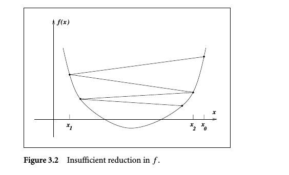
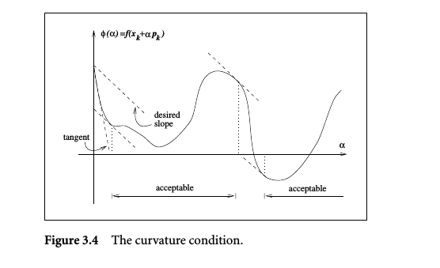

# Introduction

## Mathematical formulation

optimization is the minimization or maximization of a function subject to constraints on its variables.
$$
\min\limits_{x\in R^n}f(x)\quad subject\ to \ \ 
{\begin{align}
& c_i(x)=0,\quad i\in \xi \\
& c_i(x)\geq 0,\quad i \in \varphi
\end{align}}
$$

 ## Classification


- continuous versus dscrete optimization

- constrained and unconstrained optimization

- global and local optimization

- stochastic and deterministic optimization 

  ​

## Convexity

If the objective function in the optimization problem and the feasible region are both convex, then **any local solution of the problem is in face a global solution.**

*convex programming* is used to describe a special case of the general constrained optimization problem in which:

- the objective functions is convex
- the equality constraint functions are linear and 
- the in equality constaint functions are concave.


# Fundamentals of Unconstrained Optimization

The mathematical formulation is 
$$
\min\limits_{x}f(x), \quad x\in R^n, n\geq 1
$$
Usually,we lack a global perspective on the function f, all we know are the values of f and maybe some of its derivatives at a set of points x0,x1,x2... 

##What is a Solution

- *weak local minimizer*: if there is a neighborhood *N* (an open set that contains x0) of x0 such that f(x0)<=f(x) for all x in N.
- *strict local minimizer:* change <= to <
- *isolated local minimizer*: if x is the only minimizer in N

Example: some strict local minimizer are not isolated, such as:  that as x->0 there exists alots of strict local minimizer.
$$
f(x)=x^4cos(1/x)+2x^4
$$
while all isolated local minimizers are strict.

###Recognizing a local minimum

In particular, if f is twice continuously differentiable, we may examine that x is a local minimizer by examing just the gradient \nabla f(x) and the Hessian \laplace f(x)

####Taylor's theorem

suppose that *f*:
$$
f:R^n\to R (continuously \ differentiable ),\quad p \in R^n
$$

$$
f(x+p) = f(x)+ \nabla f(x+tp)^Tp, for \ some\ t \in(0,1)
$$

and if f is twice continuously differentiable:
$$
\nabla f(x+p) = \nabla f(x)+\int_0^1\nabla^2f(x+tp)p \ dt
$$
and we have:
$$
f(x+p)=f(x)+\nabla f(x)^Tp+\frac{1}{2}p^T\nabla^2f(x+tp)p \quad for \ some \ t \in (0,1)
$$

#### First-Order Necessary Conditions

if x is a local minimizer and f is continuously differentiable in an open neightborhood of x.the:
$$
\nabla f(x)=0
$$

####Second-Order Necessary Conditions

if x is a local minimizer of f and twice differentiable is continuous in an open neightborhood of x.
$$
\nabla f(x)=0 \quad and \quad \nabla^2 f(x) is \ positive \ semidefinite
$$

#### Second-Order Sufficient Conditions

If f's twice differentiable is continuous in an open neightborhood of x and that 
$$
\nabla f(x)=0 \quad and \quad \nabla^2 f(x) is \ positive \ definite
$$
then x is a strict local minimizer of f.


#### Convexity

when f is convex, any local minimizer x is a global minimizer of f. If in addition f is differentiable, then any stationary point x is a global minimizer of f . means every stationary point is global minimizer.

## Overview of algorithms

iteration from x0 to xk, there are two fundamental strategies for moving from current xk to a new iterate x(k+1).Two strategies: Line search and trust region

**line search**: the algorithm choose a direction p and searchs along this direction from current iterate xk for a new iterate with a lower function value.(seems that gradient descent is a line search algorithms)
$$
\min\limits_{\alpha>0}\ f(x_k+\alpha p_k)
$$
**trust region**: use information about f to construct *model function* m_k, whose behavior near the current point x_k is similar to that of the actual objective function f.
$$
\min\limits_{p}m_k(x_k+p), \quad where\ x_k+p\ lies\ inside\ the\ trust\ region
$$
if the candidate solution does not produce a sufficient decrease in f, we conclude that the trust region is too large, we shrink it and re_solve. usually we used a quadratic function of the form 
$$
m_k(x_k+p)=f_k+p^T\nabla f_k+\frac{1}{2}p^TB_kp
$$


The major different of this two strategies is the **order** in which they choose the direction and distance of the move to next interate. and the major issues of this two strategies  are related . choice of the search direction p_k in line search methods, and the choice of the Hessian B_k in trust-region methods.

####Search directon for line search methods

- One important direction is gradient descent, Use Taylor's theorem, with any direction p and step-length parameter alpha

$$
f(x_k+\alpha p)=f(x_k)+\alpha p^T\nabla f_k+\frac{1}{2}\alpha^2p^T\nabla^2f(x_k+tp)p\quad for some \ t\in (0,\alpha)
$$

​    the steepest way is 
$$
\min\limits_{p}p^T\nabla f_k\quad subject \ to \ ||p||=1
$$
​    then p is the minus gradients direction.
$$
p=-\nabla f_k/||\nabla f_k||
$$

- Another important search direction-perhaps the most important one of all is the *Newton direction*. For the moment that hessian is positive definite, In consideration of Hessian, we have the 

$$
p_k^N=-(\nabla^2 f_k)^{-1}\nabla f_k
$$

​    the drawback is Hessian, calculation is too complex. *Quasi-Newton* search direction s provide an attractive to     Newton's method, we use approximation B_k to replace the Hessian

- *nonlinear conjugate gradient methods*:
  $$
  p_k = -\nabla f(x_k)+\beta_kp_{k-1}
  $$
  only need first-order deriviate and much more effective than the steepest descent direction and almost as simple to compute.needs small memory.

####Models for trust-region methods

- B_k = 0, then we got the steepest descent answer
- B_k = Hessian, has the trust-region Newton method (highly effective in practice)
- B_k = quasi-Newton approximation, we obtain a trust-region quasi-Newton method.

####Scaling

reconstruct you variable and make solution more balanced


# Line Search Methods

The iteration is given by :
$$
x_{k+1}=x_k+\alpha_kp_k
$$
we demands that p_k to be a descent direction:(theta between p_k and gradient less then pi/2)
$$
p_k^T\nabla f_k<0
$$
and we also have this form :
$$
p_k=-B_k^{-1}\nabla f_k
$$
B_k is symmetric and nonsingular matric, as for steepest descent method, B_k issimply the identity matrix;while in Newton's method，B_k is the exact Hessian ; In quasi-Newton methods B_k is an approximation to Hessian that is update at every interation by means of a low-rank formula.

### 3.1 Step Length

A picture below shows the *insuffient decrease* when we choose the bad step length.



**Armijo condition**: A popular inexact line search condition stipulate that a_k should first of all give sufficient decrease in the objective function f, as measured by:(**Armijo condition**)
$$
f(x_k+\alpha p_k)\leq f(x_k)+c_1\alpha\nabla f_k^Tp_k ,\quad c_1\in (0,1)
$$
In practical, c_1 is chosen to be quite small, say c_1=10^-4

**Curvature condition:**only the sufficient decrease condition is not enough, we need a second requirement:
$$
\nabla f(x_k+\alpha_kp_k)^Tp_k\geq c_2\nabla f_k^Tp_k, \quad c_2\in(c_1,1)
$$


this is to ensure that at this step length, the object function will not decrease more then our initial point, for example in the Figure3.4,the unacceptable point has a smaller slope means they can decrease more, so we should get more step length, otherwise we can not be closer to global minimizer(slope=0).

**Wolfe conditions**: combination of Armijo condition and Curvature condition
$$
f(x_k+\alpha p_k)\leq f(x_k)+c_1\alpha\nabla f_k^Tp_k ,\quad c_1\in (0,1)\\
\nabla f(x_k+\alpha_kp_k)^Tp_k\geq c_2\nabla f_k^Tp_k, \quad c_2\in(c_1,1)
$$


**The Goldstein conditions:** ensure that the step length alpha achieves sufficient decrease but is not too short.
$$
f(x_k)+(1-c)\alpha_k\nabla f_k^Tp_k \leq f(x_k+\alpha_k p_k)\leq f(x_k)+c\alpha_k \nabla f_k^Tp_k
$$


Algorithm(Backtracking Line search): ensure we get a step (a) is small enough but its last step (a/p) is bigger then the Armijo condition, here is the code(python)

```python
def backtracing_line_search(f, xk, pk, scale, c, init_length=1):
    """
    :param f: function object, has f.eval(vector), f.diff(vector),
    :param xk: start_point = (R^n vector)
    :param pk: decrease_vector = (R^n vector)
    :param scale: back tracing contraction factor
    :param c: Armijo condition scale factor c1
    :param init_length: usually 1
    :return: search length at point xk
    """
    step_length = init_length
    while f.eval(xk + pk * step_length) <= f.eval(xk) + c * step_length * f.diff(xk) * pk:
        step_length *= scale
    return step_length

```

###3.2 Convergence of line search methods

a line search method has chosen search direction p_k, we define \theta_k is the angle between p_k and the steepest descent direction -\nabla f_k
$$
cos \theta_k=\frac{-\nabla f_k^Tp_k}{||\nabla f_k|| ||p_k||}
$$
we can **proof the convergence** of line search method from the **Wolfe conditions** for the well define problem:

**This conditions ensure that the step alpha for each point k need to: first decrease faster than the deriviate f at point k, second the k+1 point has to be more flat otherwise the point is worse than k,we should get another step. **

**Well define means the problem ,the optimization function f needs to first differentiable,second bounded below,third constrained on its deriviate(Lipschiz continuous) **

The whole theorem is describle as :

*suppose that f is bounded below in R^n and that f is continuously differentiable in a open set N containing the level set {x:f(x)<=f(x0)},where x0 is the starting point of the iteration.Assume also that the gradient \nabla f is Lipschiz continuous on N,that is, there exists a constant L>0 such that*
$$
||\nabla f(x)-\nabla f(x_1)|| \leq L||x-x_1||, \quad for \ all \ x,x_1 \in N
$$
*then*
$$
\sum_{k\geq0}cos^2\theta_k||\nabla f_k||^2<\infty
$$
*this is called Zoutendijk condition which implies:*
$$
cos^2\theta_k||\nabla f_k||^2\to0
$$
*it our method ensure the angle theta is bounded away from 90, means exist a constant sigma*
$$
cos\theta_k \geq \sigma >0
$$
*we could immediately have that:*
$$
{\lim_{k \to \infty}}||\nabla f_k||=0
$$
so we have the method could attracted by stationary points(as for convex,is  the global minimizer).

###3.3 Rate Of Convergence

we knew that by constrain theta to be enough far from 90 (orthogonal to deriviate) we could get a convergence at last. but for some ill-conditioned problem, constrain of theta may harm the rate of convergence.the design of a method should incorporate both properties:

**Good global convergence guarantees and a  Rapid rate of convergence**

####Steepest Descent

linearly convergent


####Newton's Method

We knew that the newton's method of line search method:
$$
p_k^N=-\nabla^2f_k^{-1}\nabla f_k
$$
further we will describle two approaches for obtaining a globally convergent interation based on the Newton step:

- a line search approch, in which the Hessian is modified , if necessary to make it positive definite and thereby yield descent
- a trust region approach, in which Hessian to form a quadratic model that is minimized in a ball around the current iterate x_k

Now we discuss the local rate-of-convergence properties of Newton's method. inthe vicinity of a solution, the Hession must be all positive definite.

**Theorem3.5**

*If the Lipschiz continuous in a neighborhood of a solution x ,we could have: the rate of convergence of {x_k} is quadratic and the sequence of gradient norms ||\nabla f_k|| converges quadratically to zero*

####Quasi-Newton's Method

superlinearly convergent

###3.4 Newton's Method with Hessian Modification

The Hessian matrix may not be positive definite,so the Newton direction defined by:
$$
\nabla^2 f(x_k)p_k^N=-\nabla f(x_k)
$$
may not always be a descent direction.

To solve this problem, we could **Factorize** the matrix 
$$
B_k= \nabla^2f(x_k)+E_k
$$
where the Hessian is positive definite Ek=0, otherwise, E_k make B_k positive definite by a *bounded modified factorization* which require the sequence {Bk} have bounded that
$$
\kappa(B_k)=||B_k||\||B_k^{-1}|| \leq C, \quad some \ C>0 \ and \ all \ k=0,1,2,,...
$$


As for matrix factorization techniques that will be used to form Bk, we will assume that the eigenvalue  decomposition of  Hession(x_k) is available, which is not realistic for large-scale problems because this is generally too expensive to compute, but it still motivate several practivala modification strategies.

#### Eigenvalue modification

**First try**: Replace the Hessian's all negative eigenvalues by a small positive number \delta which
$$
\delta = \sqrt{\mu}, \quad \mu \ is \ the \ machine \ precision
$$
\mu is the machine precision such as 10-16, we can proof that this kind of modification is useless, it shrink the pk to the negative eigenvalues's direction with a value o(\delta), which means we almost still have to  face the problem in next interation.


**Second try:** we define *Frobenius norm* first:
$$
||A||_F^2=\sum_{i,j=1}^n a_{ij}^2
$$
we have a matrix A, we want to fix it to positive definite, and the additional matrix deltaA which has the *minimum Frobenius norm* to ensure that:
$$
\lambda_{min}(A+\Delta A) \geq \delta
$$
has the form:
$$
\Delta A = Q\ diag(\tau_i)\ Q^T \quad with \quad  \tau_i={\begin{align}
& 0,\quad \quad \quad \lambda_i \geq \delta\\
& \delta-\lambda_i, \quad \lambda_i<\delta
\end{align}}
$$
and the modified matrix has the form:
$$
A+\Delta A = Q(\Lambda+diag(\tau_i))Q^T
$$


**Third try:** By using Euclidean norm , we can have a different Delta A
$$
\Delta A = \tau I, \quad with\quad \tau=max(0,\delta-\lambda_{min}(A))
$$
the modified Matrix has the form:(shift all the eigenvalues to be positive)
$$
A+\tau I
$$


Summary: Both diagonal and nondiagonal modification hase been proposed and implemented in software, **They do not use the spectral decomposition of the Hessian, Instead, they use Gaussian elimination, choosing the modifications indirectly and hoping that somehow they will produce good steps.**


#### Adding A Multiple of the Identity(second try)

we should get the scalar \tau > 0　such satisfy:
$$
\Delta A = \tau I, \quad with\quad \tau=max(0,\delta-\lambda_{min}(A))
$$
 but get the smallest eigenvalue of A exactly is expensive. 

**In the next Alogrithm, we use Cholesky decomposion to distinguish whether the Modified matrix is positive difinite, if not , we will try a bigger \tau**

```python
def chol_with_added_mult_identity(A, beta=1e-3):
    """
    Cholesky decompositon of a Matrix, to try the smallest scalar of Indetity to add which will make the original input
     A  positive definite and Cholesky decompose it.
    Cholesky decompose: positive definite matrix A can be decompose as A = LL^T, L is a Lower trigonometric matrix.
    :param A:=[n,n] numpy array, Input square matrix, may not be positive definite.
    :param beta:=float, heuristic param, the initial minimum scalar.
    :return: L after Cholesky decomposition
    """
    I = np.zeros(A.shape)
    for i in range(0, I.shape[0]):
        I[i, i] = 1

    min_trace_a = min([A[i, i] for i in range(0, A.shape[0])])
    if min_trace_a > 0:
        tau = 0
    else:
        tau = -min_trace_a + beta

    while True:
        flag, L = chol_d(A + tau * I)
        if flag == True:
            return L
        else:
            tau = max(2 * tau, beta)
```

the chol_d() method was implented below,  and we could use the test example to ensure our chol_d() and chol_with_added_mult_identity() method. Here we could found that chol_d() is O(n^3).

```python
def chol_d(A):
    """
    Cholesky decompose
    :param A: Input square matrix
    :return:flag: A is positive definite or not
            L :decomposed Lower trigonometric matrix
    """

    m, n = A.shape[0], A.shape[1]
    flag = (m == n)

    if not flag or len(A.shape) != 2:
        print "A is not a square matrix"
        return False, A

    L = np.zeros(A.shape)
    for k in range(0, n):
        s = 0
        for i in range(0, k):
            s += L[k, i] ** 2
        s = A[k, k] - s
        # s = s if s > 0 else 0
        # L[k, k] = math.sqrt(s)
        if s<0:
            flag = False
            print 'sqrt error',i ,j
            break
        else:
            L[k,k] = math.sqrt(s)

        for i in range(k + 1, n):
            s1 = 0
            for j in range(0, k):
                s1 += L[i, j] * L[k, j]
            if L[k, k] == 0:
                flag = False
                print 'divide 0:', i, j
                break
            L[i, k] = (A[i, k] - s1) / L[k, k]

        for j in range(0, k):
            L[j, k] = 0

    return flag, L
```

test example A is a positive definite matrix,we could get the LA and reconstruct A = LA dot LA.T, B is not a positive definite matrix,we could get it LB too

```python
if __name__ == "__main__":
    A = np.array([[1,1,1,1,1],[1,2,2,2,2],[1,2,3,3,3],[1,2,3,4,4],[1,2,3,4,5]])
    B = np.array([[10,0,0],[0,3,0],[0,0,-1]])

    LA = chol_with_added_mult_identity(A)
    C = np.dot(LA,LA.T)
    print C-A

    LB = chol_with_added_mult_identity(B)
    D = np.dot(LB,LB.T)
    print D-B
```


#### Modified Cholesky Factorization

As we have implented the Cholesky decomposition before, see the chol() method. we could easily accept alittle variety.we use this 
$$
A = LDL^T
$$
different with Cholesky decomposition:
$$
A = MM^t
$$
In face:
$$
M= LD^{1/2}
$$
 if the diagonal elements djj are all positive ,then A is positive definite. **And if  A is not positive definite,the Cholesky Factorization may not be exists. even it exists, the elements of L or D can be very large. so our method is to :**

- Modify the procedure and A to make sure the *Cholesky Factorization* is exists and not too ill-condition(element of L and D are not too large)
- The modified LDL^T is bounded relative to the norm of the actual Hessian.

we could use two parameters (\delta, \beta) to describe our goal:
$$
d_j \geq \delta, \quad |m_{ij}|\leq \beta, \quad i=j+1,j+2,...n\\
where \quad m_{ij}=l_{ij}\sqrt{d_j}
$$
we first introduce the modification which can ensure our goal and implement chol_f(A,beta,sigma) method(Cholesky Factorization method) with threshold to bound the D and L.

**To archieve our goal ,we only need to add alittle change in how we get D, to bound the D as below:**
$$
d_j = max(|c_{jj},(\frac{\theta_j}{\beta})^2,\delta|), \quad with\ \theta_j = \max_{j<i<\leq n}|c_{ij}|
$$


```python
def chol_f(A, beta =10 ,sigma = 1e-3):
    """
        Cholesky Factorization : A = LDL^T
        return L,D using the Gaussian elimination method

    :param A: Input Square Matrix
    :param beta: threshold to hold the M(L*sqrt(D)) matrix element
    :param sigma: min threshold of main Matrix D trace element
    :return: Cholesky Factor L, main matrix D
    """
    m, n = A.shape[0], A.shape[1]
    flag = (m == n)

    if not flag or len(A.shape) != 2:
        print "A is not a square matrix"
        return False, A

    L = np.zeros(A.shape)
    C = np.zeros(A.shape)
    D = np.zeros(A.shape[0])

    for j in range(0, n):
        L[j, j] = 1

    D[0] = A[0,0]

    for j in range(0, n):
        tmp_s1 = 0
        for s in range(0, j):
            tmp_s1 += D[s] * (L[j, s] ** 2)
        C[j, j] = A[j, j] - tmp_s1

        # D[j] = C[j, j]
        # modification version
        try:
            theta = max([abs(C[i, j]) for i in range(j + 1, n)])
        except:
            theta = abs(C[n-1,j])

        D[j] = max([abs(C[j, j]), sigma, (theta / beta) ** 2])

        for i in range(j + 1, n):
            tmp_s2 = 0
            for s in range(0, j):
                tmp_s2 += D[s] * L[i, s] * L[j, s]
            C[i, j] = A[i, j] - tmp_s2
            L[i, j] = C[i, j] / D[j]

    return L, D

```

test code below, we could test the positive definite matrix A with two kinds formula.

```python
if __name__ == "__main__":
    A = np.array([[1, 1, 1, 1, 1], [1, 2, 2, 2, 2], [1, 2, 3, 3, 3], [1, 2, 3, 4, 4], [1, 2, 3, 4, 5]])
    B = np.array([[10, 0, 0], [0, 3, 0], [0, 0, -1]])
    
    test_chol_f = 1
    
    if test_chol_f:
        X=B

        LA, DA = chol_f(X)

        DB = np.zeros(X.shape)

        for i in range(0, X.shape[0]):
            DB[i, i] = DA[i]
        # A = LDL^T
        print np.dot(np.dot(LA, DB), LA.T) - X

    	# if X is positive definite, we could varify: chol_d(A) = LA * sqrt(DA)
        flag = True
        for i in range(X.shape[0]):
            flag = flag and DA[i]>=0
        if flag:
            for i in range(0, X.shape[0]):
                DB[i, i] = math.sqrt(DA[i])
            print np.dot(LA, DB) - chol_d(X)[1]

```

such as we choose B which is not positive definite,we could get the modified B which norm bound to B but is positive definite.


#### Modified Symmetric Indefinite Factorization

Another strategy for modifying an indefinite Hessian is to use a procedure based on a symmetric indefinite factorization. Any symmetric matrix A can be written as
$$
PAP^T\ = \ LBL^T
$$
where P is a permutation matrix such as [e1,e2,...en], B is a block diagonal matrix with blocks of dimension 1 or 2. **Different with Cholesky Factorization, B may contains 2x2 dimension matrix on the diagonal which make the factorization always exists**

This kind Factorization allow us to determine the *inertia* of a matrix.that is, the number of positive ,zero, negative eigenvalues. Because :

- the *inertia* of B equals the *inertia* of A.  
- the 2x2 dimensions block in B always have one positive and one negative eigenvalue.

Then the computation of spectral decomposition of B(eigenvalue decomposition) is expensive. we could implement our first try : eigenvalue modification on B, make it positive definite ,then, go back to A, over .
$$
PA^{'}P^T = L(B+F)L^T
$$

$$
With \ \delta \ and \ \lambda \ of \ B \\
F = Q\ diag(\tau_i)\ Q^T \quad with \quad  \tau_i={\begin{align}
& 0,\quad \quad \quad \lambda_i \geq \delta\\
& \delta-\lambda_i, \quad \lambda_i<\delta
\end{align}}\quad i=1,2,...n
$$

As how we implement the Symmetric Indefinite Factorization, the book didn't mention.

###3.5 Step-Length Selection Algorithms

- In 3.1 section, we design a step-length selection rules.
- In 3.2 section, we proof that if we choose the pk and step-length alpha according to our designed rules, we could have a convergent algorithm to find minimizer of objection function
- In 3.3 section, we discuss the rate of convergence of different pk(direction) selection methods
- In 3.4 section, we implement Newton's method by different modification which aim's to make Hessian positive definite without too expensive computation.

In this section, we're going to consider techniques for finding the step-length which satisfying the 3.1 section rules. Typical procedures consist of two phases:

1. *bracketing phase*: find an interval [a,b] containing acceptable step lengths
2. *selection phase*: zoom in to locate the final step length. also reduce the interval 


####Interpolation

We define:
$$
\phi(\alpha) = f(x_k+\alpha p_k)
$$
then we have to choose :
$$
\phi(\alpha_k)\leq \phi(0)+c_1 \alpha_k \phi'(0)
$$
c1 usually be small in practice(c1=1e-4). our goal is to be "efficient" in the sense that it computes the derivative as few times as possible. w use a backtracing method in section 3.1 now we will use this interpolation method which will use our function and derivate information.**Our goal is to get enough descent on phi(alpha) and our idea is to approximate the function with cubic function and find the cubic function minimzer. How to get this cubic function, we do it by interpolation.**

**Alogrithm:**

1. start with phi(0), phi(alpha0),phi'(0), if alpha_0 is  enough stop

2. using {phi(0),phi'(0),phi(alpha)} interpolate a quadratic approximation as
   $$
   \phi_q(\alpha)=(\frac{\phi(\alpha_0)-\phi(0)-\alpha_0\phi'(0)}{\alpha_0^2} )\alpha^2 + \phi'(0)\alpha+\phi(0)
   $$
   find the minimer:
   $$
   \alpha_1 = - \frac{\phi'(0)\alpha_0^2}{2[\phi(\alpha_0)-\phi(0)-\phi'(0)\alpha_0]}
   $$
   if alpha_1 is good enough, stop

3.  while alpha_k (start with k = 2)is not good enough:

    do: cubic approximate using (phi(0),phi'(0), phi( alpha_(k-1) ), phi(alpha _(k-2) ) ):
$$
   \phi_c(\alpha) = a\alpha^3 + b\alpha^2+\alpha \phi'(0) +\phi(0)\\
   where \quad\\ 
   \begin{equation}  
   \left[
     \begin{array}{c}
      a\\  
      b\\  
     \end{array}
   \right]
   =
   \frac{1}{\alpha_{k-2}^2 \alpha_{k-1}^2(\alpha_{k-1}-\alpha_{k-2})}*
   \left[
     \begin{array}{cc}
      \alpha_{k-2}^2  & -\alpha_{k-1}^2\\  
      -\alpha_{k-2}^3 & \alpha_{k-1}^3\\  
     \end{array}
   \right]
   \left[
     \begin{array}{c}
     \phi(\alpha_{k-1})-\phi(0)-\phi'(0)\alpha_{k-1}\\  
      \phi(\alpha_{k-2})-\phi(0)-\phi'(0)\alpha_{k-2}\\  
     \end{array}
   \right]

   \end{equation}
$$
   caculate alpha_k, the minimizer of this cubic approximation:
$$
   \alpha_k = \frac{-b+\sqrt{b^2-3a\phi'(0)}}{3a}
$$
   if alpha_k is too close to alpha_{k-1} or too much smaller than alpha _{k-1}, then we reset :
$$
   \alpha_k = \alpha_{k-1}/2
$$


**Summary**:Cubic interpolation is a powerful strategy, since it usually produces a quadratic rate of convergence of the interation to the minimizing value of alpha